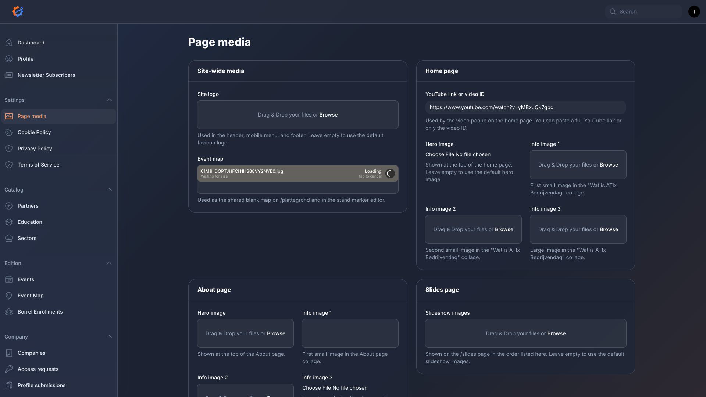
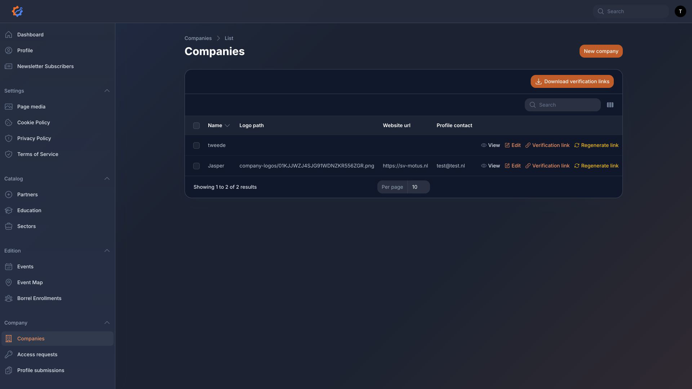
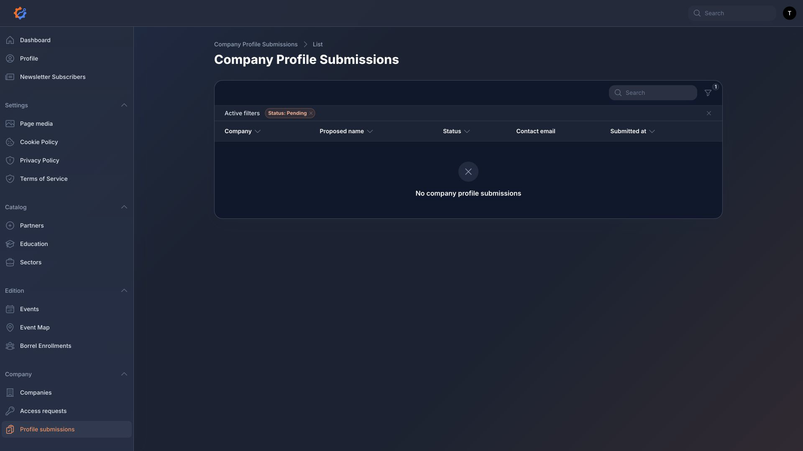
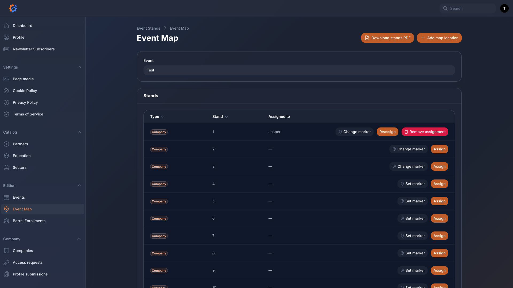
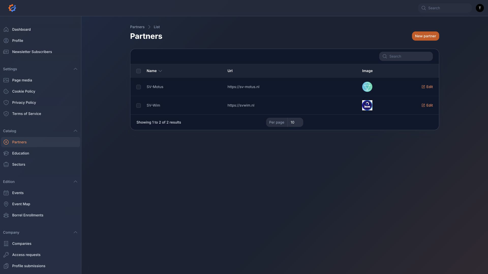
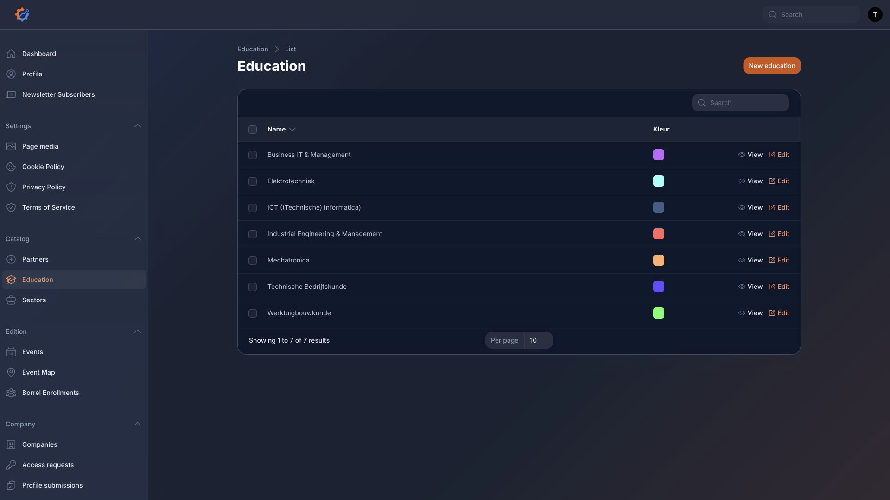
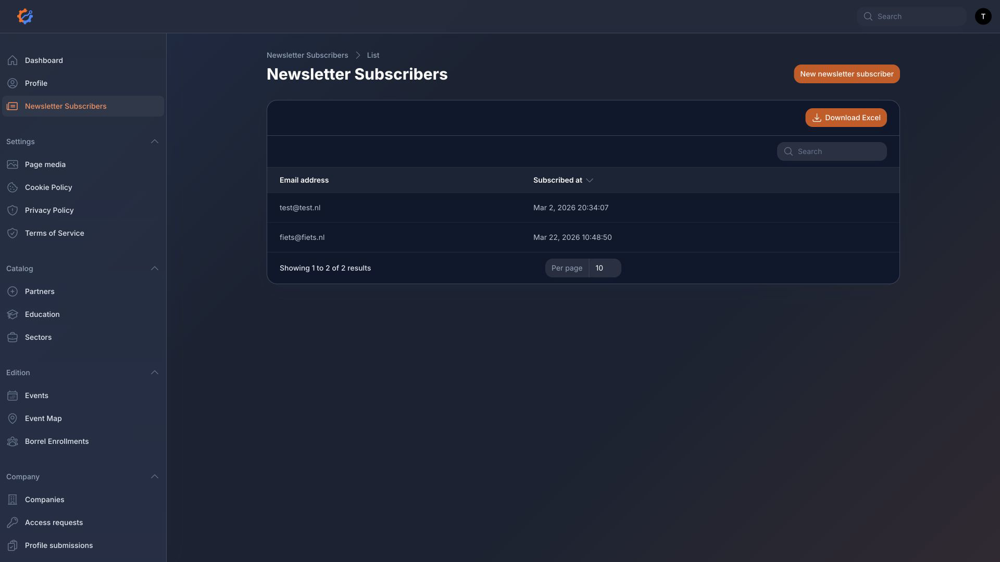
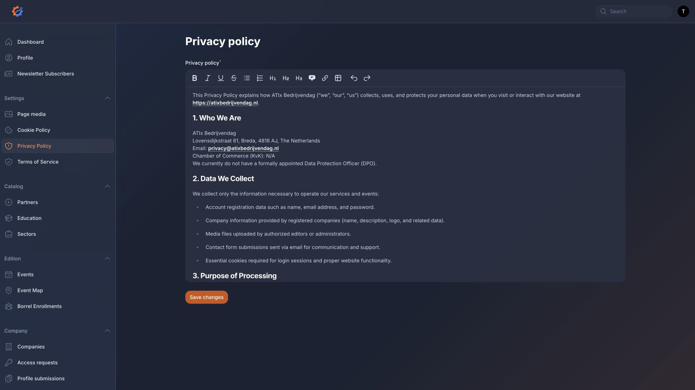
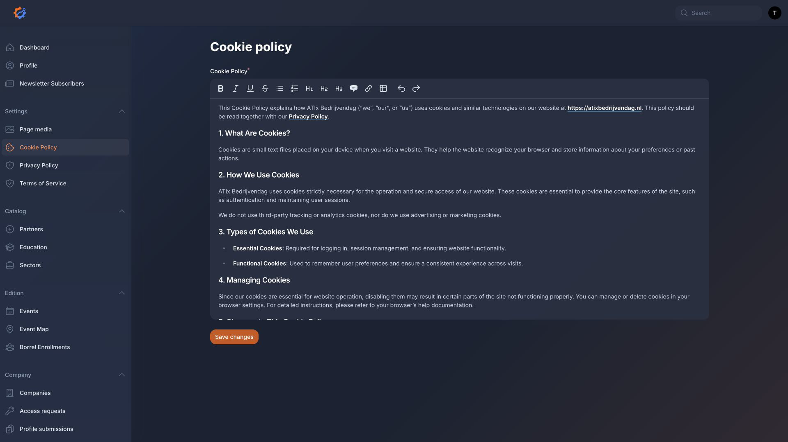

# ATIx Bedrijvendag Dashboard Documentation

This guide explains what every dashboard page is for, what it changes, and where those changes appear on the website.

Dashboard URL:

`/dashboard`

Login URL:

`/dashboard/login`

Screenshots were captured from the local dashboard at `1920x1080` viewport size on 2026-09-03.

## Access And Login

Administrators sign in at `/dashboard/login` with a dashboard user account.

Two-factor authentication is forced for dashboard users. A first-time user may need to configure 2FA before they can use the dashboard.

Company contacts do not use the dashboard. They request access on the public site, then receive a private company profile link after an administrator approves the request.

## Dashboard

Path: `/dashboard`

Purpose:

The dashboard is the landing page after login. It shows operational widgets and statistics.

Screenshot:

What it shows:

- Account widget
- Upcoming event widget
- General dashboard statistics
- Borrel enrollments per event chart
- Companies per event chart

What it changes:

Nothing directly. It is a read-only overview page.

## Page Media

Path: `/dashboard/page-media`

Purpose:

Controls shared visual content used across public website pages.

Screenshot:

What it changes:

- Site logo
- Shared event map image
- Home page YouTube link
- Home page hero image
- Home page information images
- About page hero image
- About page information images
- Slide images for `/slides`

Where it appears:

- Header, mobile menu, and footer
- `/`
- `/over-ons`
- `/slides`
- `/plattegrond`
- Event map marker editor in the dashboard

Important notes:

- The event map image is shared by the public map and the dashboard marker editor.
- If a field is left empty, the website may use a default image.

## Companies

Path: `/dashboard/companies`

Purpose:

Stores company profiles used throughout the website and dashboard.

Screenshot:

What it changes:

- Company name
- Company logo
- Website URL
- Profile contact email
- Public company description
- Related educations
- Related sectors

Where it appears:

- `/bedrijven`
- `/edities/{event}`
- `/plattegrond`
- Event stand assignment lists
- Company profile review workflows

Common actions:

- Create a company
- View company details
- Edit a company
- Link educations and sectors

Important notes:

- A company must be linked to an event or stand before it appears in event-specific pages.
- The profile contact email is used for company profile communication workflows.

## Company Access Requests

Path: `/dashboard/company-access-requests`

Purpose:

Reviews access requests submitted by company contacts on `/bedrijf-toegang`.

Screenshot:

What it changes:

- Request status: pending, approved, or rejected
- Review note
- Reviewer and reviewed timestamp
- Company access state
- Private verification/profile link availability

Where it appears:

- Dashboard request list
- The request detail page
- Email sent to the company contact after approval

Common actions:

- View request details
- Approve request
- Reject request
- Copy the private verification link after approval

Important notes:

- Approving tries to email the private company profile link.
- If email sending fails, the dashboard shows a warning.
- New-company requests can create or link company access depending on the approval logic.

## Company Profile Submissions

Path: `/dashboard/company-profile-submissions`

Purpose:

Reviews profile edits submitted by company contacts through private `/bedrijf-profiel/{token}` links.

Screenshot:

What it changes after approval:

- Company name
- Company logo
- Company website URL
- Company description
- Related educations
- Related sectors
- Submission status and review metadata

Where it appears:

- `/bedrijven`
- `/edities/{event}`
- `/plattegrond`
- Company records in the dashboard

Common actions:

- View proposed changes
- Approve changes
- Reject changes
- Add a review note

Important notes:

- Submitted company changes are not public immediately.
- They only become visible after approval.
- Rejecting keeps the existing company profile unchanged.

## Events

Path: `/dashboard/events`

Purpose:

Creates and manages Bedrijvendag editions/events.

Screenshot:

What it changes:

- Event name
- Event date
- Number of company stands
- Number of partner stands
- Organising partners
- Google Photos album URL
- Event description
- Event header image
- Related companies
- Related borrel enrollments

Where it appears:

- `/`
- `/edities`
- `/edities/{event}`
- `/bedrijven`
- `/partners`
- `/plattegrond`
- Borrel sign-up logic

Common actions:

- Create event
- View event
- Edit event
- Assign or change companies through the event relation manager
- View related borrel enrollments

Important notes:

- The website prefers the next upcoming event.
- If there is no upcoming event, it falls back to the latest past event.
- `Company stands` and `Partner stands` control how many rows are created in the Event Map page.

## Event Map

Path: `/dashboard/event-stands`

Purpose:

Manages event stand rows, stand assignments, and map marker positions.

Screenshot:

Lower table screenshot:

What it changes:

- Which company is assigned to each company stand
- Which partner is assigned to each partner stand
- Stand marker coordinates
- Map location records such as bar, info, lunch, entrance, and other
- Map location marker coordinates

Where it appears:

- `/plattegrond`
- `/edities/{event}`
- Stand PDF export

Common actions:

- Select the event to manage
- Assign or reassign a company stand
- Assign or reassign a partner stand
- Remove an assignment
- Set or change a stand marker
- Add a map location
- Edit a map location type
- Delete a map location
- Download stands PDF

Important notes:

- Event Map stand rows are synced from the selected event's stand counts.
- The top table manages stand assignments and stand markers.
- The lower `Map Locations` table manages non-stand map markers such as bar, entrance, info, and lunch.
- Reducing stand counts can remove extra stand rows beyond the new limit.
- A company or partner assignment is kept unique for the selected event and stand type.

## Borrel Enrollments

Path: `/dashboard/borrel-enrollments`

Purpose:

Stores borrel registrations.

Screenshot:

What it changes:

- Event associated with the registration
- Name
- Email address

Where it appears:

- Dashboard lists and charts
- Event relation manager
- Home page borrel count while sign-up is open

Common actions:

- Create enrollment
- View enrollment
- Edit enrollment

Important notes:

- Public borrel sign-up is accepted only for future events.
- The public form prevents duplicate email registrations for the same event.

## Partners

Path: `/dashboard/partners`

Purpose:

Manages partner records used by events and partner stands.

Screenshot:

What it changes:

- Partner name
- Website URL
- Description
- Related educations
- Partner logo/image

Where it appears:

- `/partners`
- `/`
- `/plattegrond`
- `/edities/{event}`
- Event partner assignment fields
- Partner stand assignment fields

Common actions:

- Create partner
- Edit partner
- Link educations
- Upload partner logo

## Education

Path: `/dashboard/education`

Purpose:

Manages study programmes used as metadata and filters.

Screenshot:

What it changes:

- Education name
- Description
- Website URL
- Display color

Where it appears:

- Company profiles
- Partner profiles
- Company filters
- Partner metadata

Common actions:

- Create education
- View education
- Edit education

## Sectors

Path: `/dashboard/sectors`

Purpose:

Manages business sectors used for companies.

Screenshot:

What it changes:

- Sector name
- Description

Where it appears:

- Company records
- Public company filtering and metadata

Common actions:

- Create sector
- View sector
- Edit sector

## Newsletter Subscribers

Path: `/dashboard/newsletter-subscribers`

Purpose:

Shows newsletter sign-ups submitted from the public website.

Screenshot:

What it changes:

Nothing. This resource is read-only in the dashboard.

Where it appears:

- Dashboard subscriber list

Important notes:

- Creating, editing, and deleting newsletter subscribers are disabled in this resource.

## Privacy Policy

Path: `/dashboard/manage-privacy-policy`

Purpose:

Manages the privacy policy content.

Screenshot:

What it changes:

The content shown on `/privacy-policy`.

## Terms Of Service

Path: `/dashboard/manage-terms-of-service`

Purpose:

Manages the terms of service content.

Screenshot:

What it changes:

The content shown on `/terms-of-service`.

## Cookie Policy

Path: `/dashboard/manage-cookie-policy`

Purpose:

Manages the cookie policy content.

Screenshot:

What it changes:

The content shown on `/cookie-policy`.

## My Profile

Purpose:

Lets dashboard users manage their own account profile and two-factor authentication.

Screenshot:

What it changes:

- User profile information
- Password
- Two-factor authentication settings
- Browser sessions, depending on the available Breezy profile features

Important notes:

- Two-factor authentication is forced by the dashboard configuration.
- Do not disable 2FA unless the dashboard configuration changes.

## Suggested Dashboard Workflow

For a new edition:

1. Create or update `Education` and `Sectors`.
2. Create or update `Companies`.
3. Create or update `Partners`.
4. Create the `Event`.
5. Set `Company stands` and `Partner stands` on the event.
6. Add organising partners to the event.
7. Upload the event map image in `Page media`.
8. Open `Event Map`.
9. Select the event.
10. Assign companies and partners to stands.
11. Place stand markers.
12. Add map locations such as entrance, info, lunch, and bar.
13. Check `/plattegrond`, `/bedrijven`, `/partners`, and `/edities/{event}`.

For company profile updates:

1. Review `Company access requests`.
2. Approve valid requests.
3. Wait for company contacts to submit updates through their private links.
4. Review `Company profile submissions`.
5. Approve or reject the submitted changes.
6. Check the public company pages.

## Screenshot Policy

Dashboard screenshots should be viewport screenshots at `1920x1080`, not full-page captures.

Current screenshot:

- `docs/screenshots/dashboard-login-1920x1080.png`
- `docs/screenshots/dashboard-overview-1920x1080.png`
- `docs/screenshots/page-media-1920x1080.png`
- `docs/screenshots/companies-1920x1080.png`
- `docs/screenshots/company-access-requests-1920x1080.png`
- `docs/screenshots/company-profile-submissions-1920x1080.png`
- `docs/screenshots/events-1920x1080.png`
- `docs/screenshots/event-map-1920x1080.png`
- `docs/screenshots/event-map-locations-table-1920x1080.png`
- `docs/screenshots/borrel-enrollments-1920x1080.png`
- `docs/screenshots/partners-1920x1080.png`
- `docs/screenshots/education-1920x1080.png`
- `docs/screenshots/sectors-1920x1080.png`
- `docs/screenshots/newsletter-subscribers-1920x1080.png`
- `docs/screenshots/privacy-policy-1920x1080.png`
- `docs/screenshots/terms-of-service-1920x1080.png`
- `docs/screenshots/cookie-policy-1920x1080.png`
- `docs/screenshots/profile-1920x1080.png`

These screenshots were captured from the authenticated test dashboard account.
