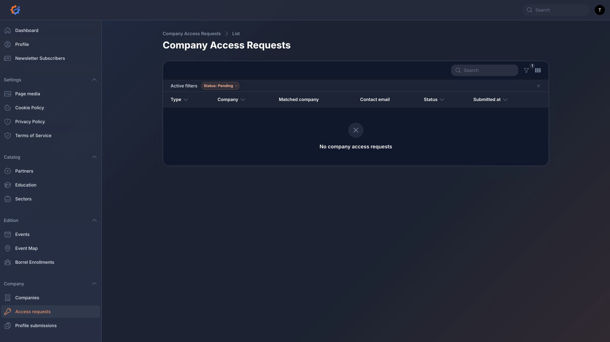
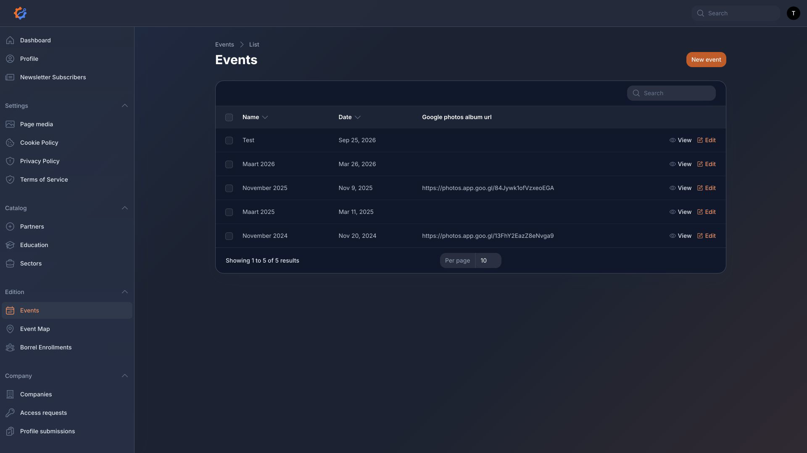
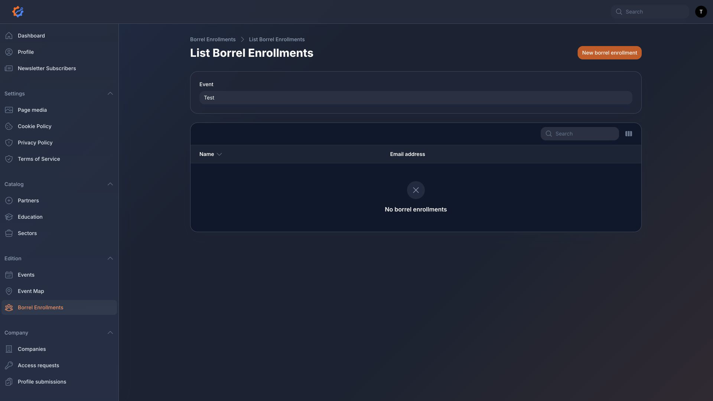
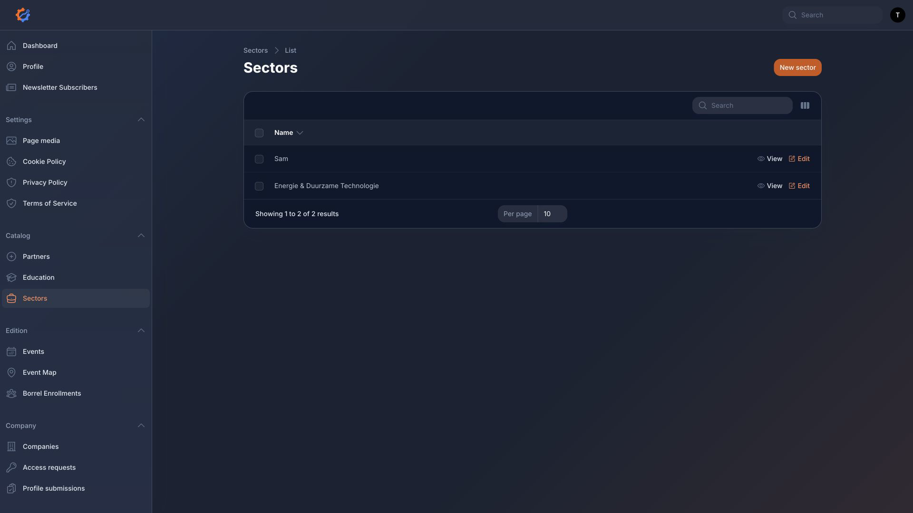
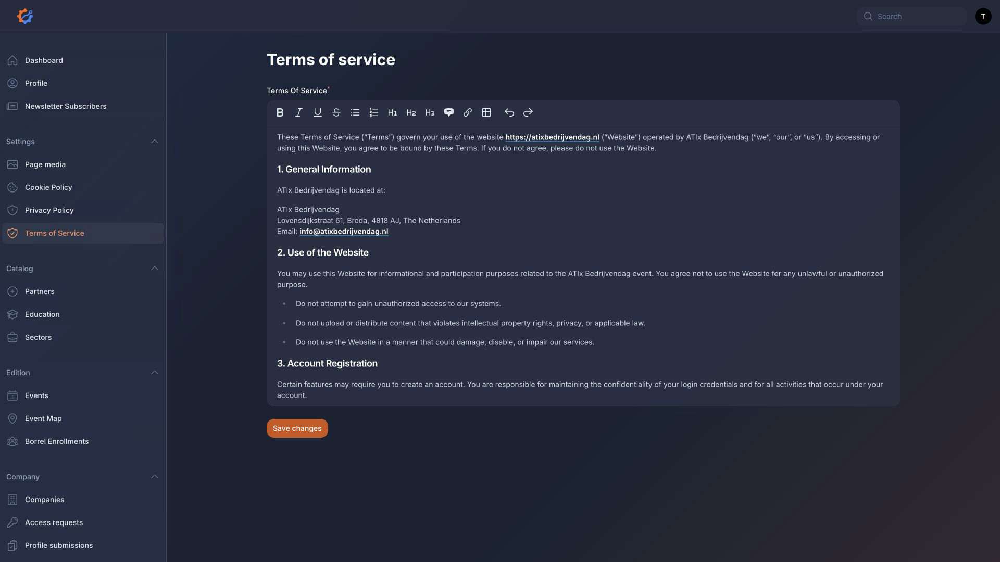
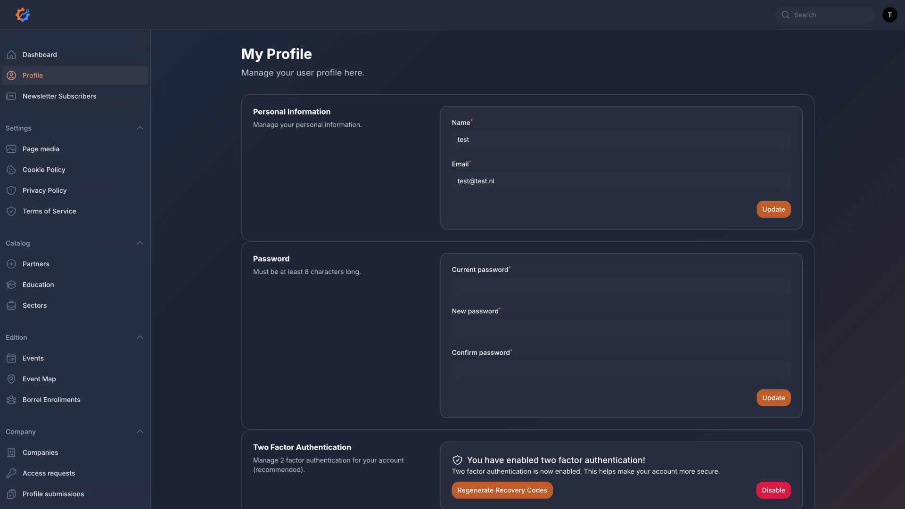

# Dashboard Page Reference

Administrators manage site content from the Filament dashboard at `/dashboard`.

## Dashboard

Path: `/dashboard`

Shows account information, the upcoming event widget, dashboard statistics, borrel enrollment charts, and company-per-event charts. This page is an overview and does not directly change records.

## Page Media

Path: `/dashboard/page-media`

Controls shared images and media: site logo, event map image, home page media, YouTube link, about page media, and slide images.

Changes appear in the public header/footer, home page, about page, slides page, public event map, and dashboard marker editor.

## Companies

Path: `/dashboard/companies`

Manages company records. It changes company names, logos, website URLs, profile contact emails, descriptions, educations, and sectors.

Changes appear in company listings, event pages, map markers, and stand assignment lists once the company is linked to an event or stand.

## Company Access Requests

Path: `/dashboard/company-access-requests`

Reviews requests submitted by company contacts. Administrators can view, approve, reject, add review notes, and copy private verification links.

Approving attempts to email the company contact a private profile link.

## Company Profile Submissions

Path: `/dashboard/company-profile-submissions`

Reviews proposed company profile edits submitted through private company profile links. Approving updates the company profile; rejecting leaves the existing profile unchanged.

## Events

Path: `/dashboard/events`

Manages editions/events. It changes event name, date, company stand count, partner stand count, organising partners, Google Photos URL, description, header image, related companies, and borrel enrollments.

Event data controls the home page highlight, edition pages, company list, partners page, public map, and borrel sign-up logic.

## Event Map

Path: `/dashboard/event-stands`

Manages stand rows, company/partner assignments, stand marker coordinates, map locations, and stand PDF export.

The available stand rows are synced from the selected event's company and partner stand counts.

The lower `Map Locations` table manages non-stand map markers such as bar, entrance, info, lunch, and other.

## Borrel Enrollments

Path: `/dashboard/borrel-enrollments`

Manages borrel registrations by event, name, and email address.

## Partners

Path: `/dashboard/partners`

Manages partner name, website URL, description, related educations, and logo/image.

## Education

Path: `/dashboard/education`

Manages study programmes, descriptions, website URLs, and display colors.

## Sectors

Path: `/dashboard/sectors`

Manages business sector names and descriptions.

## Newsletter Subscribers

Path: `/dashboard/newsletter-subscribers`

Shows newsletter sign-ups. Creating, editing, and deleting are disabled.

## Policy Pages

Paths:

- `/dashboard/manage-privacy-policy`
- `/dashboard/manage-terms-of-service`
- `/dashboard/manage-cookie-policy`

These pages change the public privacy policy, terms of service, and cookie policy pages.

## My Profile

Lets dashboard users manage their profile, password, browser sessions, and two-factor authentication settings.

## Navigation groups

- `Dashboard` - statistics, upcoming event widget, companies per event chart, and borrel enrollments chart.
- `Companies` - company records, logos, descriptions, websites, educations, and sectors.
- `Company access requests` - public access requests from company contacts.
- `Company profile submissions` - proposed profile edits from private company links.
- `Events` - event records, event details, related companies, and related borrel enrollments.
- `Event Map` - stand map and marker placement for event stands.
- `Borrel enrollments` - borrel sign-up records.
- `Partners` - partner records used on the partners page and event stands.
- `Education` - study programmes used for filtering and company/partner metadata.
- `Sectors` - business sectors used for filtering and company metadata.
- `Newsletter subscribers` - read-only list of newsletter sign-ups.
- `Page media` - site logo, event map, home page media, about page media, YouTube link, and slide images.
- `Manage privacy policy` - privacy policy content.
- `Manage terms of service` - terms of service content.
- `Manage cookie policy` - cookie policy content.
- `My Profile` - account profile and two-factor authentication settings.
