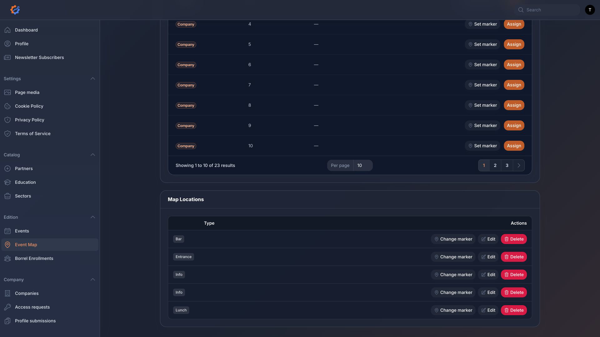

# Content Management

This page explains which dashboard page to use when changing common content.

## Site media

Dashboard page: `Page media`

Use this section to update:

- Site logo
- Shared event map image
- Home page hero image
- Home page information images
- Home page YouTube link
- About page images
- Slide images for `/slides`

After saving media, check the related public page to confirm the image appears as expected.

## Companies

Dashboard page: `Companies`

Use this section to manage participating companies. Company records can include:

- Name
- Logo
- Website URL
- Description
- Related educations
- Related sectors

Companies become visible on public event pages when they are linked to an event.

## Events and editions

Dashboard page: `Events`

Use this section to create and edit Bedrijvendag editions. Event records power:

- The highlighted event on the home page
- The `/edities` overview
- Individual `/edities/{event}` pages
- The current `/bedrijven` list
- The `/plattegrond` map
- Borrel sign-up availability

The website automatically chooses the next upcoming event when one exists. If there is no upcoming event, it falls back to the latest past event.

## Event map and stands

Dashboard page: `Event Map`

Use this section to assign stands and place stand markers on the event map. The public map uses the shared map image configured in `Page media`.

Map points such as entrance, info, lunch, and bar are managed in the lower `Map Locations` table on the Event Map page.

## Partners

Dashboard page: `Partners`

Use partner records for organising/support partners and partner stands. Partner records can include:

- Name
- Logo
- Website URL
- Description
- Related educations

## Education and sectors

Dashboard pages: `Education`, `Sectors`

Use these catalog sections to keep filtering and profile metadata consistent across companies and partners.

## Newsletter subscribers

Dashboard page: `Newsletter subscribers`

This is a read-only list of newsletter sign-ups. The resource does not allow creating, editing, or deleting subscribers from the dashboard.

## Legal content

Dashboard pages:

- `Manage privacy policy`
- `Manage terms of service`
- `Manage cookie policy`

Use these pages to update the text shown on the public legal pages.
