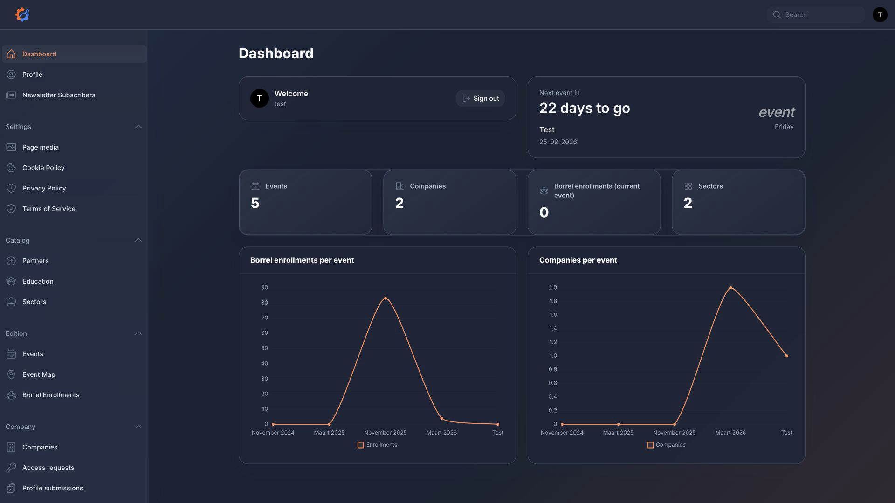

# ATIx Bedrijvendag Wiki

This wiki explains how to use the ATIx Bedrijvendag dashboard.

## Pages

- [Login and Access](Login-and-Access)
- [Admin Dashboard](Admin-Dashboard)
- [Company Profile Workflow](Company-Profile-Workflow)
- [Content Management](Content-Management)
- [Troubleshooting](Troubleshooting)
- [Publishing the GitHub Wiki](Publishing-the-GitHub-Wiki)

## Quick Summary

Administrators use `/dashboard/login` to manage events, companies, partners, the event map, media, legal pages, company access requests, and company profile submissions.

