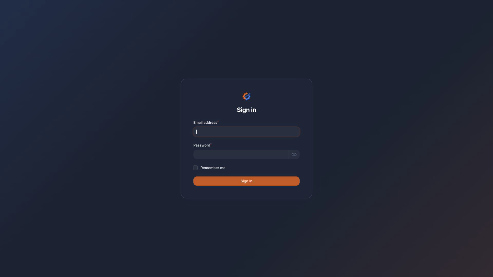

# Dashboard Login and Access

## Administrators

Administrators log in at:

`/dashboard/login`

Use a valid dashboard email address and password. The dashboard uses Filament and is available at `/dashboard` after login.

Two-factor authentication is forced for dashboard users, so first-time users may need to configure 2FA before they can continue.

## Company contacts

Company contacts do not log in through the dashboard. They request access at:

`/bedrijf-toegang`

After an administrator approves the request, the company contact receives a private profile link:

`/bedrijf-profiel/{token}`

The private token opens the profile editing form for that company. Tokens can expire.

Company contacts can only edit a limited company profile form. They cannot access the dashboard.
